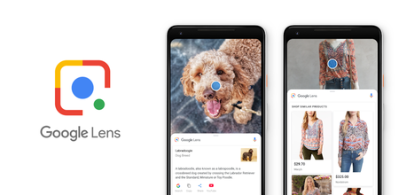

# PRÁCTICA DE LA NUBE 

Para analizar de una mejor manera el funcionamiento del almacenamiento en la nube, el alumno comparará varias de las diferentes nubes existentes en el mercado. Y empleará una aplicación del móvil llamada Google Lens que servirá como introducción al siguiente tema: La inteligencia artificial (IA) y además servirá de ejemplo práctico de almacenamiento en la nube. 
Por otro lado, para comprender de mejor manera los peligros que supone esta nueva revolución, comprobaremos los archivos personales almacenados por ciertas compañías.
Se pretende así, que el alumno comprenda que esta herramienta es de gran utilidad pero que hay que tener cuidado al emplearla debido a que la exposición pública , y por tanto a la perdida de la intimidad, es mayor.

## COMPARACIÓN DE GOOGLE DRIVE Y OFFICE 365
Empleando la cuentas proporcionadas por la universidad de navarra inicie sesión en Office 365 en la Web así como en Google Drive. Para está práctica se requiere que el alumno compare de manera superficial los siguientes elementos:

+ Interfaz de inicio: Claridad y sencillez.
+ Qué programas ofrece cada plataforma.
+ Compatibilidad con dispositivos.
+ Utilidad
+ Máximo almacenamiento que ofrece cada plataforma.
+ Libertad de uso.
+ ¿Más comentarios?

## GOOGLE LENS
Para este apartado de la práctica se requiere que el alumno descargue en su dispositivo móvil la aplicación Google Lens. En caso de que el profesor no quiera hacer que el alumno descargue la aplicación puede mostrarla en su propio dispositivo.

Google Lens es una aplicación Web que permite identificar objetos médiate Inteligencia Artificial, compararlos con una base de datos almacenada en la nube y así conocer sus características. Mediante esta app, uno puede encontrar objetos similares al que aparecen en la cámara en diferentes catálogos de tiendas y así conocer sus precios y especificaciones.

Por tanto es un gran ejemplo de aplicaciones prácticas que pueden darse tanto a la inteligencia artificial como al almacenamiento en la nube.

## ANALISIS DE PELIGROS DE ALMACEMAMIETNO EN LA NUBE

El almacenamiento en la nube supone una gran revolución. El guardar archivos en la nube facilita la interacción entre usuarios y agiliza procesos que de otra manera serían imposibles de realizar. 
Con ello, se abre un nuevo escenario de seguridad debido a que los archivos del usuario pasan de poder ser robados de sus dispositivos personales a poder ser robados en internet. Además,  existe la posibilidad de que se expongan datos privados de manera pública y/o que se almacenen sin autorización.

Para visualizar estos peligros el alumno comprobará los archivos de voz que Google ha almacenado en su cuenta personal y que ahora se encuentran en internet. Puede que más de uno se lleve una sorpresa al encontrar archivos de voz que ni siquiera sabía que existían.
Para ello, el alumno seguirá los siguientes pasos:

+ En tu teléfono o tablet Android, abre la app de Configuración del dispositivo Google Cuenta de Google.
+ En la parte superior, presiona Datos y personalización.
+ En "Actividad y rutas", presiona Mi actividad.
+ En la barra de búsqueda, presiona Filtrar por fecha y producto y escoja tan solo los audios.

Datos tomados de: 
+ [Link 1](https://www.xertica.com/computacion-en-la-nube-definicion-ejemplos-y-usos-practicos/)
+ [Link 2](https://www.xertica.com/blog/spotify-google-cloud)
+ [Link 3](https://cloud.google.com/customers/ubisoft/)
